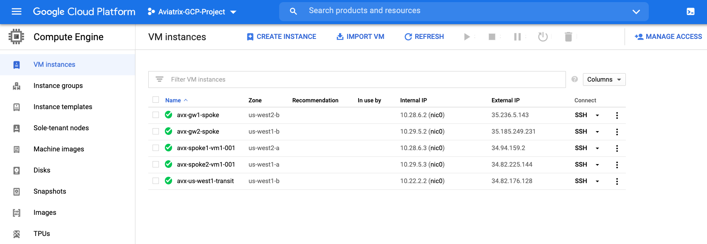

# Test Kit

Built using https://registry.terraform.io/modules/terraform-google-modules/vm/google/latest

This is a simple, minimal example of how to use the compute_instance module to create test vms in the Aviatrix spokes built with Belmont. 

#### Place the GCP json key of _your GCP Service Account_ this directory and modify references to it..

```
provider.tf
terraform.tfvars
```

The ssh key ```~/.ssh/id_rsa.pub``` will be used in the instances.

Grab the public ip's from the console and login using ```ubuntu```

### GCP Console




